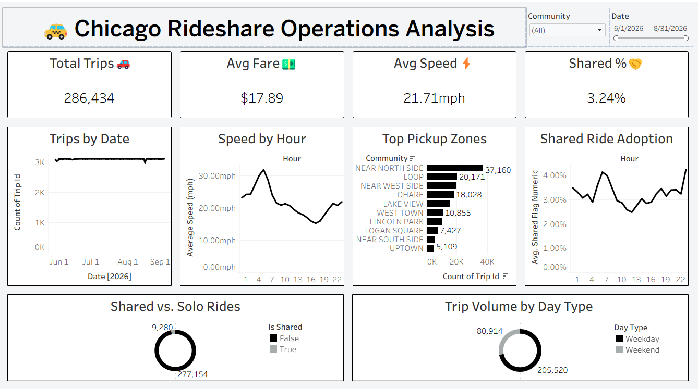

# 🚕 Chicago Rideshare Operations Analysis

## 📌 Project Overview
This project is a comprehensive rideshare operations analysis built using **Python, SQL, and Tableau**. It provides data-driven insights into Chicago's rideshare (Uber/Lyft/Via) trip activity, including:

- Demand patterns by hour and day of week
- Identification of high-volume pickup zones
- Congestion and trip-speed analysis across the day
- Fare and revenue breakdowns by zone and time
- Shared-ride adoption trends
- Weekday vs. weekend booking behavior

The goal of this dashboard is to help businesses, analysts, and city planners make informed operational decisions based on real rideshare trip data.

## 🚀 Features
✅ **Interactive Dashboard:** User-friendly interface with Date and Community Area filters.
✅ **Dynamic Visualizations:** Includes trend lines, bar charts, donut charts, and a zone-level breakdown table.
✅ **ETL Pipeline:** Data pulled live via the Socrata Open Data API, cleaned and transformed with Python/Pandas.
✅ **Data Cleaning & Validation:** Removes invalid records, deduplicates, handles missing zone data, and engineers derived fields (hour, day of week, trip speed).
✅ **SQL Analysis Layer:** Full set of analytical queries covering demand, fare/revenue, shared-ride behavior, zone comparisons, and trip efficiency.
✅ **Custom Insights:** Includes findings such as the highest-fare zone, peak congestion hour, and busiest pickup zone.

## 📂 Dataset Used
**Data Source:** [City of Chicago Data Portal](https://data.cityofchicago.org) — Transportation Network Providers (Rideshare) Trips dataset

**Access method:** Pulled directly via the Socrata Open Data API (not a static download). Raw CSV data is intentionally excluded from this repo (see `.gitignore`) — the notebook below can be re-run at any time to regenerate the full dataset live from the source.

**Period:** June – August 2026 (3-month sample, ~286,000 trips, evenly sampled across all hours and days to avoid time-of-day bias)

**Key fields used:** trip start/end time, pickup/dropoff community area, trip miles, trip seconds, fare, tip, trip total, shared-trip flags.

## 🔧 Technologies Used
| Technology | Purpose |
|---|---|
| Python (Pandas) | Data extraction (API), cleaning, feature engineering |
| MySQL | Data storage & SQL analysis |
| SQL | Aggregations, subqueries, conditional logic |
| Tableau | Dashboard design & interactive visualization |

## 📊 Dashboard Insights
The dashboard uncovers key operational patterns, including:

- **Demand Concentration:** Near North Side alone generated **37,160 trips** — roughly double the next-highest zone — with top zones mapping cleanly onto Chicago's downtown, nightlife, and airport corridors.
- **Congestion Pattern:** Average trip speed drops from a peak of **~32 mph around 5 AM** to a low of **~15.3 mph around 5 PM**, a clean congestion signature across the day.
- **Fare Economics:** O'Hare has the highest average fare (**$36.51**) — more than double the busiest zone — showing that trip *volume* and trip *revenue* don't concentrate in the same place.
- **Shared-Ride Behavior:** Adoption remains low overall (~3.24% of trips), with modest peaks in early morning and late evening.

| Metric | Value |
|---|---|
| Total Trips | 286,434 |
| Average Fare | $17.89 |
| Average Speed | 21.71 mph |
| Shared-Ride Rate | 3.24% |

## 🔗 Live Dashboard

**Click the image above to explore the interactive Tableau dashboard live.**

## 📁 Repository Contents
- [`chicago_rideshare_analytics.ipynb`](chicago_rideshare_analytics.ipynb) — Data extraction & cleaning (Python/Pandas)
- [`queries.sql`](queries.sql) — Full SQL analysis query set

## ▶️ How to Reproduce
1. Clone this repo.
2. Open the notebook in Jupyter or Google Colab and run all cells — this pulls fresh data directly from the Chicago Data Portal API.
3. Load the cleaned data into MySQL and run `queries.sql` to reproduce the analysis.
4. (Optional) Connect Tableau to the resulting table to rebuild the dashboard.

## 📄 License
This project is licensed under the MIT License — see [LICENSE](LICENSE) for details. The underlying dataset is sourced from the City of Chicago Data Portal and used under its open data terms.

---

Feel free to star ⭐ this repository if you found it useful! 🚀
